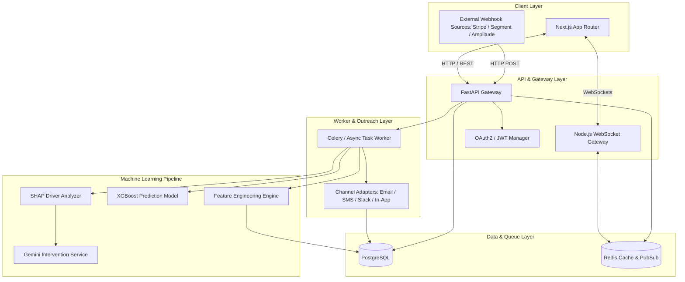
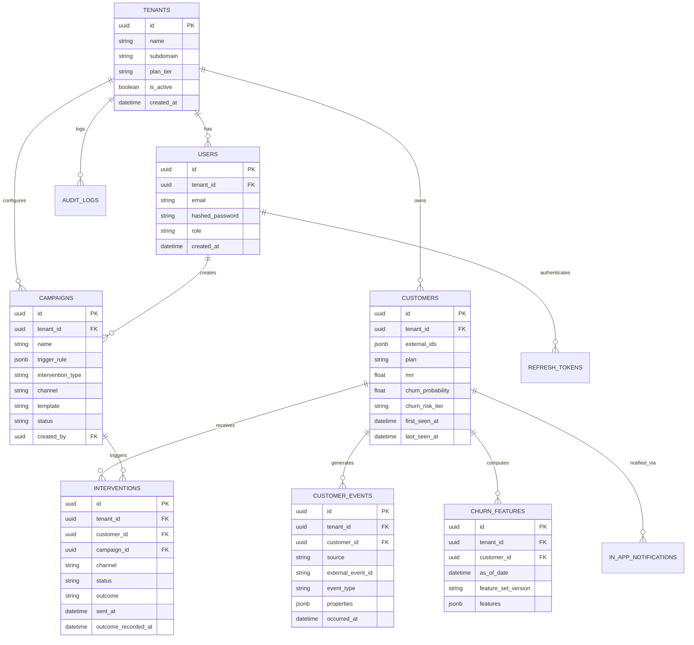
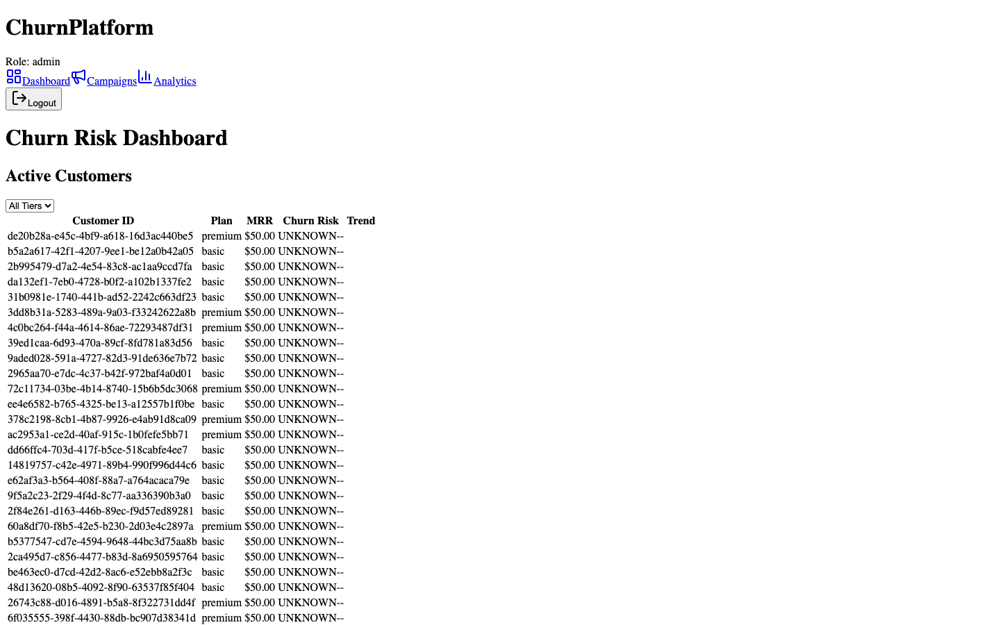
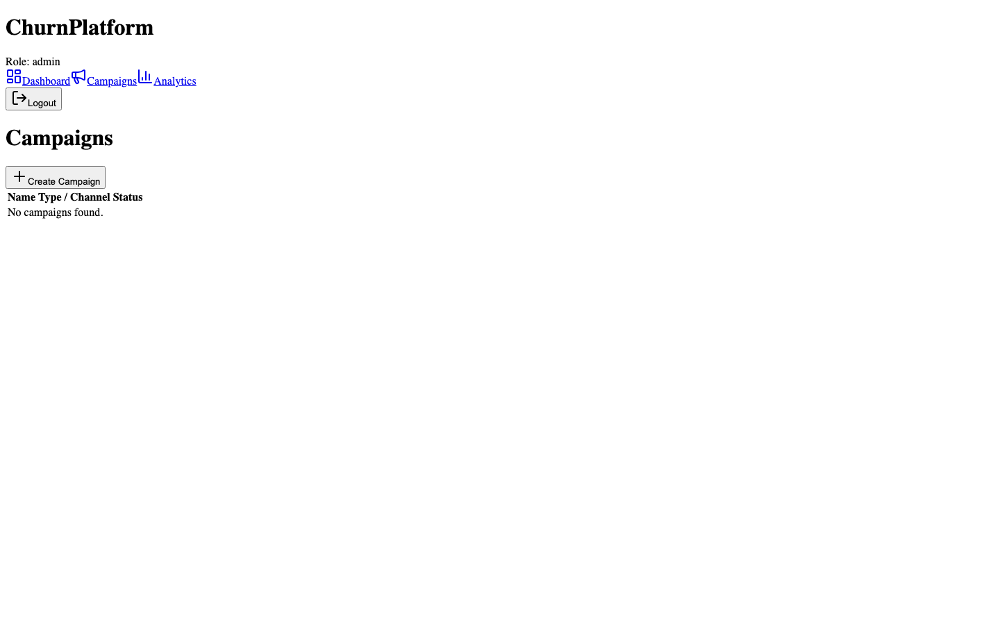

# Customer Churn Prediction and Intervention Platform

A multi-tenant SaaS platform built to predict customer churn risks and automate retention interventions before subscription cancellation occurs. The system ingests billing and usage telemetry, computes predictive risk scores with XGBoost, generates natural language explanations using Google Gemini, and executes targeted outreach across multiple messaging channels.

## System Architecture

The platform follows a modular microservices architecture, separating event ingestion, feature computation, machine learning inference, and campaign execution.



## Entity Relationship Diagram

The PostgreSQL database enforces tenant isolation across all entities using tenant IDs and structured primary/foreign keys.



## Tech Stack

- **Frontend**: Next.js (App Router), TypeScript, Tailwind CSS, Lucide React, Playwright.
- **API Core**: Python 3.12, FastAPI, Async SQLAlchemy 2.0, Pydantic v2, Alembic.
- **Realtime Server**: Node.js, Express, Socket.io, Redis Pub/Sub.
- **Machine Learning**: XGBoost, Scikit-learn, Pandas, SHAP, Google Gemini API (`google-genai`).
- **Data & Caching**: PostgreSQL 16, Redis 7.
- **Security & Infrastructure**: AES-GCM column encryption, PyJWT, Docker, Docker Compose, OpenTelemetry, Prometheus, Grafana.

## Application Previews

### Customer Churn Risk Dashboard
Filter and inspect customers sorted by risk tier, monthly recurring revenue (MRR), and feature trend trajectories.



### Campaign Builder & Outreach Rules
Configure automated campaigns that trigger specific outreach channels when a customer meets risk score thresholds.



## Local Development & Setup

### Prerequisites
- Docker and Docker Compose installed on your system.
- Node.js 18+ and Python 3.12+ (if running outside Docker).

### Step 1: Clone the Repository
```bash
git clone https://github.com/SatyamPandey07/Customer-Churn-Prediction-Intervention-Platform.git
cd Customer-Churn-Prediction-Intervention-Platform
```

### Step 2: Environment Configuration
Copy the sample environment file to `.env`:
```bash
cp .env.example .env
```
Ensure `GEMINI_API_KEY` is configured if you intend to generate Gemini-powered risk explanations.

### Step 3: Run the Application Suite
Start the full stack (Database, Redis, API Gateway, Realtime Gateway, and Frontend Web App):
```bash
docker-compose up -d --build
```

### Step 4: Seed Synthetic Training & Demo Data
Populate the database with customer histories, events, and model predictions:
```bash
docker-compose exec api python /app/apps/api/scripts/generate_synthetic_churn_data.py
```

### Step 5: Access the Web Services
- **Web Dashboard**: [http://localhost:3000](http://localhost:3000) (Login credentials: `admin@example.com` / `Password123!`)
- **API Documentation**: [http://localhost:8001/docs](http://localhost:8001/docs)
- **Realtime Gateway**: `ws://localhost:3001`
